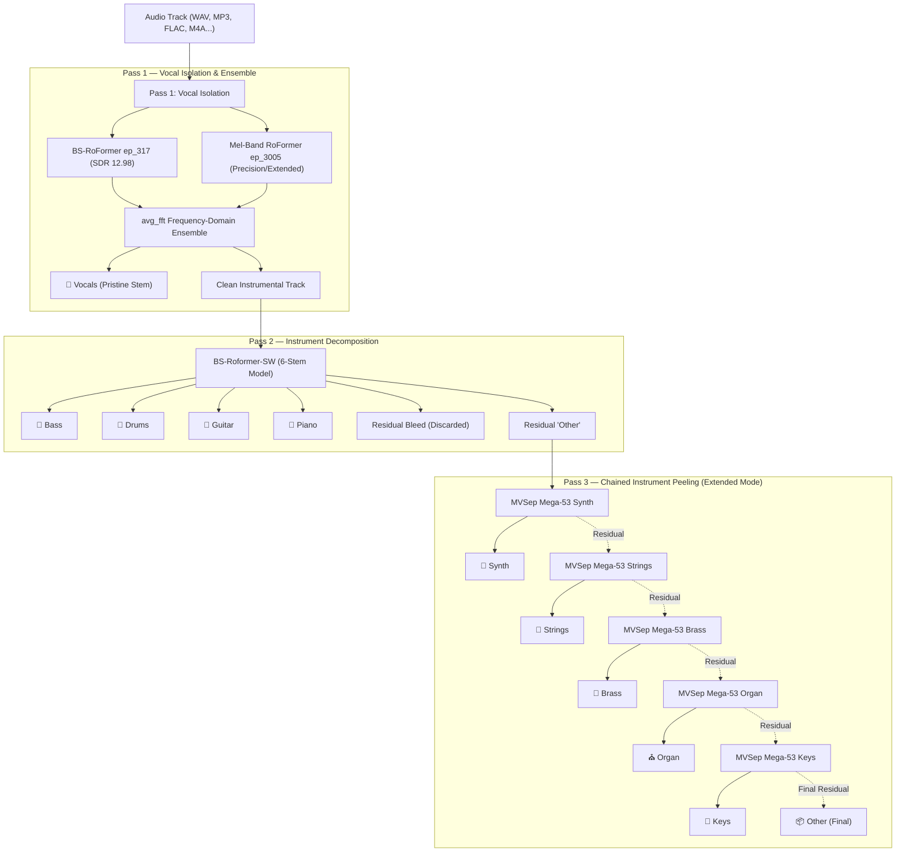

# 🎚️ Stem Splitter Studio

[](https://www.python.org/downloads/)
[](https://fastapi.tiangolo.com)
[](https://pytorch.org)
[](https://github.com/nomadkaraoke/python-audio-separator)
[](https://opensource.org/licenses/MIT)

**Stem Splitter Studio** is a high-fidelity, local audio stem separation studio powered by state-of-the-art **RoFormer** (Band-Split & Mel-Band RoFormer) neural network models. 

It matches and exceeds DAW-grade separation (such as Logic Pro's Stem Splitter) by cascading isolated passes to eliminate vocal bleed, ensembling dual vocal models for pristine isolation, and offering up to **11 distinct stems** with an in-browser DAW-style multitrack mixer.

---

## 🌟 Key Highlights

- 🧠 **Zero Vocal Bleed Cascading Pipeline**: Passes isolate pure vocals first, then separate the instrumental bed into instruments—discarding residual vocal leakage so guitars, keys, and drums remain clean.
- 🎛️ **Up to 11 Discrete Stems**: Separates `Vocals`, `Bass`, `Drums`, `Guitar`, `Piano`, and `Other`, plus extra chained extractions for `Synth`, `Strings`, `Brass`, `Organ`, and `Keys`.
- 🎧 **Interactive Multitrack Web DAW**: Built-in player with synchronized multi-stem playback, real-time Solo / Mute, individual Volume faders, Stereo Pan, seeking, and single-click full multitrack ZIP export.
- 🛡️ **VRAM-Safe GPU Worker**: Serialized job queue prevents Out-Of-Memory (OOM) crashes, running smoothly even on entry-level **4 GB / 6 GB / 8 GB VRAM** GPUs (e.g. RTX 3050 Laptop, GTX 1650, RTX 4060).
- 💎 **Audiophile Quality Presets**: Native FP16 execution, spectral frequency-domain ensembling (`avg_fft`), custom overlap masking, and source bit-depth preservation (24-bit / 32-bit float).
- 💾 **Persistent Job State**: Jobs and stem metadata persist to disk; server restarts won't break client polling or active downloads. Automatic 24-hour cleanup keeps disk usage tidy.

---

## 🔬 Separation Pipeline Architecture

Stem Splitter Studio avoids running a naive all-in-one model that often leaves vocal artifacts in guitars or pianos. Instead, it uses a **multi-stage cascading architecture**:



### Why Cascading?
When standard 6-stem models process a full song, backing vocals and vocal reverberations frequently leak into guitar, piano, and other mid-range stems. By removing the vocals first with flagship 2-stem vocal models (SDR > 12.9 dB) and running the multi-stem model strictly on the resulting instrumental, residual vocal bleed is completely eradicated.

---

## ⚙️ Quality Presets

| Preset | Stems Output | Models Used | Overlap | Target Bit Depth | Best For |
| :--- | :--- | :--- | :---: | :---: | :--- |
| **⚡ Fast** | **6 stems**<br>*(Vocals, Bass, Drums, Guitar, Piano, Other)* | `BS-RoFormer ep_317` + `BS-RoFormer-SW` | Default (4 / 2) | 16-bit (0.9 peak norm) | Quick draft stems, quick remixing, practice backing tracks |
| **🎯 Precision** | **6 stems**<br>*(Vocals, Bass, Drums, Guitar, Piano, Other)* | `BS-RoFormer ep_317` + `Mel-Band RoFormer ep_3005` (Ensemble) + `BS-RoFormer-SW` | High (6 / 4) | Lossless (Preserves 24-bit / 32-bit float) | Critical mastering, acapellas, final DAW production mixes |
| **🪄 Extended** | **11 stems**<br>*(Base 6 + Synth, Strings, Brass, Organ, Keys)* | Precision pipeline + 5× Chained `MVSep Mega-53` 2-stem models | High (6 / 4 / 3) | Lossless (Preserves 24-bit / 32-bit float) | Orchestral music, complex electronic tracks, full stem deconstruction |

---

## 🎵 Supported Audio Formats

Accepts uploads up to **300 MB**:
- `.wav`, `.flac`, `.aiff` (Lossless uncompressed / compressed)
- `.mp3`, `.m4a`, `.aac`, `.ogg`, `.opus`, `.wma` (Compressed audio)

Outputs are delivered in pristine **WAV format** (44.1 kHz, preserving original bit-depth up to 24/32-bit in Precision/Extended modes).

---

## 🚀 Getting Started

### 1. Prerequisites

- **OS**: Windows 10/11, Linux, or macOS
- **Python**: 3.10 or 3.11 recommended
- **NVIDIA GPU**: Recommended for CUDA acceleration (supports CUDA 11.8 / 12.x). CPU inference is supported but significantly slower.
- **FFmpeg**: Ensure `ffmpeg` is installed and accessible in your system `PATH`.

### 2. Installation

Clone the repository:
```bash
git clone https://github.com/owenbhenex/Stem-Split-Studio.git
cd Stem-Split-Studio
```

Create and activate a virtual environment:
```bash
# Windows
python -m venv .venv
.venv\Scripts\activate

# Linux / macOS
python3 -m venv .venv
source .venv/bin/activate
```

Install PyTorch with CUDA support (for NVIDIA GPUs):
```bash
# Example for CUDA 12.1 (adjust for your CUDA version if needed):
pip install torch torchvision torchaudio --index-url https://download.pytorch.org/whl/cu121
```

Install the project dependencies:
```bash
pip install -r requirements.txt
```

### 3. Model Storage (Optional)

By default, model checkpoints (`.ckpt`) and configurations will be stored in:
- Windows: `C:/tmp/audio-separator-models`
- Or configured via environment variable:

```bash
# Windows (PowerShell)
$env:AUDIO_SEPARATOR_MODEL_DIR = "D:\Models\audio-separator-models"

# Linux / macOS
export AUDIO_SEPARATOR_MODEL_DIR="/path/to/models"
```

Models are downloaded automatically by `audio-separator` upon their first use.

---

## 🖥️ Running the Studio

Start the FastAPI application:

```bash
python app.py
```

Or run via Uvicorn with reload enabled:
```bash
uvicorn app:app --host 127.0.0.1 --port 8000
```

Open your browser and navigate to:
```
http://127.0.0.1:8000
```

---

## 🎛️ Multitrack Mixer & Workflow

1. **Upload & Configure**: Drag and drop your audio file onto the dropzone. Choose between **Fast**, **Precision**, or **Extended** preset.
2. **Background Processing**: The status view tracks progress through each separation pass in real time.
3. **Interactive Studio Player**:
   - **Play/Pause / Scrub**: Synchronously control all stems across the timeline.
   - **Solo (`S`)**: Instantly isolate any stem (e.g. isolate Vocals or Drums).
   - **Mute (`M`)**: Silence specific instruments to create instant instrumental or minus-one karaoke tracks.
   - **Volume & Pan**: Adjust individual stem gain and stereo placement.
4. **Export Options**:
   - Download individual stems via the `⬇` button next to each channel.
   - Click **Download all (ZIP)** to retrieve the complete multitrack session with clean naming (`[Song Name] - [Stem].wav`).

---

## 🔌 REST API Reference

The backend exposes clean REST endpoints for automation and headless workflows:

### Upload Audio
```http
POST /api/upload
Content-Type: multipart/form-data
```
**Form Parameters:**
- `file`: Audio file binary (max 300 MB)
- `quality`: `fast` | `precision` | `extended`

**Response:**
```json
{
  "status": "queued",
  "job_id": "8f3b2a1c0d4e"
}
```

### Poll Status
```http
GET /api/status/{job_id}
```
**Response (Processing):**
```json
{
  "status": "processing",
  "stage": "Pass 1/2 — Isolating vocals (BS-RoFormer)",
  "name": "song.mp3",
  "quality": "precision"
}
```
**Response (Completed):**
```json
{
  "status": "completed",
  "stage": "Done",
  "name": "song.mp3",
  "quality": "precision",
  "stems": [
    "/api/download/8f3b2a1c0d4e/vocals.wav",
    "/api/download/8f3b2a1c0d4e/bass.wav",
    "/api/download/8f3b2a1c0d4e/drums.wav",
    "/api/download/8f3b2a1c0d4e/guitar.wav",
    "/api/download/8f3b2a1c0d4e/piano.wav",
    "/api/download/8f3b2a1c0d4e/other.wav"
  ],
  "stem_details": [
    { "name": "Vocals", "file": "vocals.wav", "size": 31457280 },
    ...
  ]
}
```

### Download Individual Stem
```http
GET /api/download/{job_id}/{filename}
```
Returns `audio/wav` stream with secure path sanitization.

### Download All Stems (ZIP)
```http
GET /api/download/{job_id}
```
Streams a ZIP archive containing all extracted stems labeled by instrument.

---

## 📁 Project Structure

```text
Stem_Split/
├── app.py               # FastAPI backend, GPU worker thread, audio pipeline
├── static/
│   └── index.html       # Single-page web DAW, audio player & mixer
├── web_uploads/         # Temporary incoming audio files (auto-pruned)
├── web_stems/           # Separated stems & persistent state.json (auto-pruned)
├── requirements.txt     # Python package dependencies
├── .gitignore           # Ignores virtual environments, uploads, and stems
└── README.md            # Project documentation
```

---

## 🤝 Credits & Acknowledgements

- **[audio-separator](https://github.com/nomadkaraoke/python-audio-separator)**: Exceptional Python library powering model execution and ensembling.
- **[ZFTurbo](https://github.com/ZFTurbo)** & **Kimberley Jensen**: Creators and fine-tuners of the flagship `BS-RoFormer` and `Mel-Band RoFormer` models.
- **ViperX / Susumu**: Authors of the `BS-Roformer-SW` multi-stem model.
- **[MVSep](https://mvsep.com)**: Model hosting, research, and the Mega-53 instrument extraction models.
- **[FastAPI](https://fastapi.tiangolo.com)** & **[Tailwind CSS](https://tailwindcss.com)**: Lightning fast backend framework and clean UI styling.

---

## 📄 License

This project is licensed under the [MIT License](LICENSE).
Models downloaded by this tool may carry their own respective licenses and non-commercial research designations. Please review the terms of each model architecture before commercial deployment.
